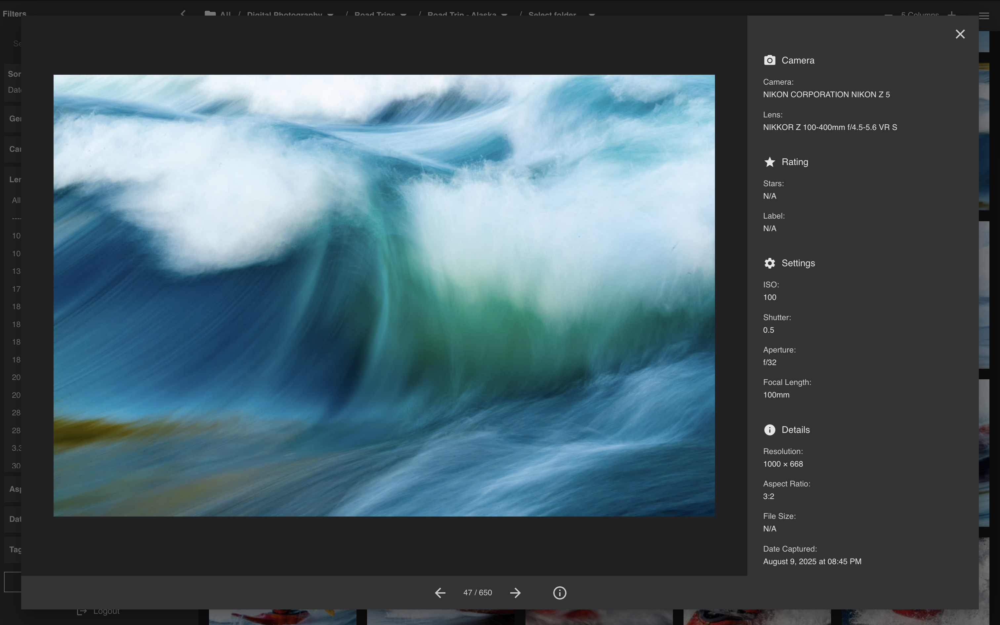
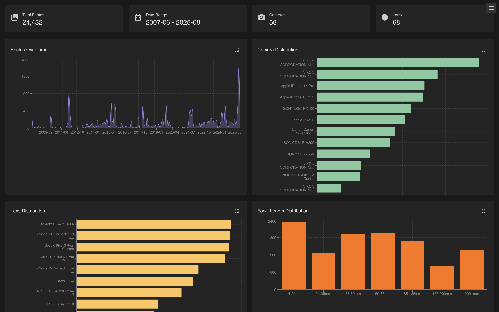

# Photo Gallery

Self-hosted photo gallery for browsing Lightroom photos quickly.





Built with React + Vite, Express + Drizzle, and SQLite. Managed via npm workspaces.

## Local Setup

```bash
./bootstrap.sh
```

This installs dependencies, copies `.env.example` files, and runs database migrations. Once done, configure your `.env` files (see below) and run `npm run dev` (frontend on :5200, backend on :8084).

## Configuration

### `backend/.env`

- `PORT` - Server port (default `8084`)
- `DATABASE_URL` - Path to the SQLite database file
- `NODE_ENV` - `development` or `production`
- `SESSION_SECRET` - Secret for signing session cookies (use a strong random value)
- `APP_PASSWORD` - Password for logging into the app (use a strong random value)

### `ingestion/.env`

- `DATABASE_URL` - Path to the SQLite database file (default `../backend/sqlite.db`)
- `SOURCE_DIR` - Directory to scan for exported photos
- `INGEST_MODE` - `local` for development, `production` to enable rsync to remote server
- `DRY_RUN` - `true` to preview without processing, `false` to run for real
- `SSH_HOST` - Remote host for rsync (production mode only)
- `SSH_DEST_DIR` - Remote directory for rsync (production mode only)

## Ingestion

Ingestion takes photos out of your library, extracts metadata, generates thumbnails, and loads the data into the database.

1. Preparing Photos
    - Lightroom:
        1. `File -> Export` and click `Add`. Select the preset in `lightroom-export-presets`.
        2. Selecting `Export To: Same folder as original photo` will allow the Photo Gallery to generate a folder structure for ease of navigation. Alternatively select a single folder outside of the library to not take advantage of this feature.
    - No other apps are currently supported, feel free to reach out if another is wanted.

2. `npm run ingest`

## Deployment

```bash
./deploy.sh
```

Builds the frontend and backend locally, then syncs everything to the remote NearlyFreeSpeech host (`nfs_photo-gallery`). The script:

1. Installs dependencies and builds both frontend (Vite) and backend (TypeScript)
2. Rsyncs the compiled backend, frontend dist, migrations, and `run.sh` to `/home/protected/`
3. Installs production dependencies on the remote server and sets permissions

The remote `.env` and `sqlite.db` are **not** overwritten by the deploy — manage those on the server directly. In production the backend serves the frontend dist, so no separate web server is needed for the SPA.

Remote layout after deploy:

```
/home/protected/
├── dist/              # backend compiled JS
├── frontend-dist/     # frontend built assets
├── drizzle/           # migration files
├── public/
│   ├── images/
│   └── thumbnails/
├── sqlite.db
├── .env
├── package.json
├── run.sh
└── node_modules/
```
