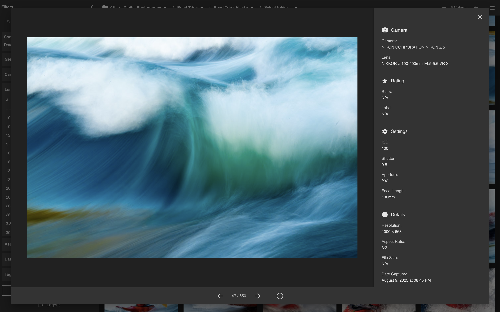
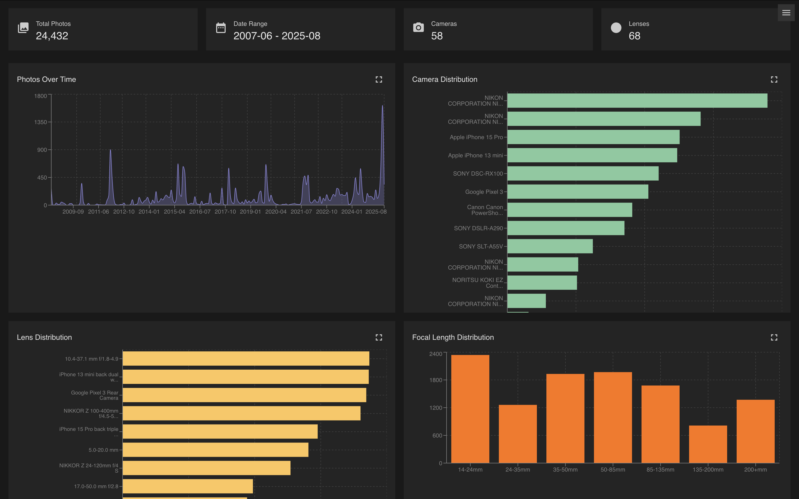

# Photo Gallery

Self-hosted photo gallery for browsing Lightroom photos quickly.

## Features

- Browse thousands of photos without lag
- Filter by camera, lens, date, rating, color label, and more
- Navigate by folder structure
- Search your entire library
- Semantic content search ("photos of mountains at sunset") via vision-LLM tagging
- People and pets search via local face recognition (label clusters once, search by name)
- See stats about your photography habits
- Works on phone and desktop
- Password protected
- Easy Lightroom export workflow





Built with React + Vite, Express + Drizzle, and SQLite. Managed via npm workspaces.

## Local Setup

```bash
./bootstrap.sh
```

This installs dependencies, copies `.env.example` files, and runs database migrations. Once done, configure `backend/.env` (see below) and run `npm run dev` (frontend on :5200, backend on :8084).

## Configuration

### `backend/.env`

- `PORT` - Server port (default `8084`)
- `DATABASE_URL` - Path to the SQLite database file
- `NODE_ENV` - `development` or `production`
- `SESSION_SECRET` - Secret for signing session cookies (use a strong random value)
- `APP_PASSWORD` - Password for logging into the app (use a strong random value)

## Ingestion

All ingestion — turning raw photos into browsable, searchable data (ingest, content
tagging, face/dog detection + clustering, and cluster labeling) — lives in the
**`offline-ingestion/`** workspace. It's the single home for this; nothing in the
frontend or backend performs ingestion. Run it with `cd offline-ingestion && ./oi`.

See **[`offline-ingestion/README.md`](offline-ingestion/README.md)** for setup,
configuration, model servers, and hardware/timing.

## Deployment

```bash
./deploy.sh        # or: npm run deploy
```

Builds the frontend and backend locally, then pushes the **code** to the remote
NearlyFreeSpeech host (`nfs_photo-gallery`). The script:

1. Installs dependencies and builds both frontend (Vite) and backend (TypeScript)
2. Rsyncs the compiled backend, frontend dist, migrations, the `shared` package, and `run.sh` to `/home/protected/`
3. Installs production dependencies on the remote and runs database migrations

The remote `.env` is **not** overwritten by the deploy — manage it on the server
directly. In production the backend serves the frontend dist, so no separate web
server is needed for the SPA.

`deploy.sh` only pushes code. The database and images are produced locally by
`offline-ingestion`; getting them onto the host is a manual rsync when you need it.

Remote layout after deploy:

```
/home/protected/
├── dist/              # backend compiled JS
├── frontend-dist/     # frontend built assets
├── drizzle/           # migration files
├── public/
│   ├── images/
│   └── thumbnails/
├── sqlite.db
├── .env
├── package.json
├── run.sh
└── node_modules/
```
