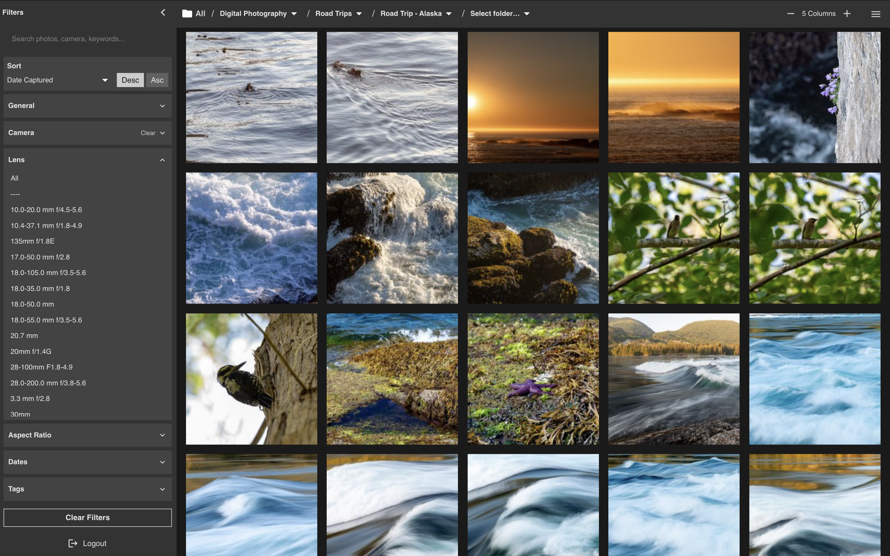

# Your Own Gallery

Your whole Lightroom library, self-hosted and instant on your phone.

## Features

- Browse thousands of photos without lag
- Filter by camera, lens, date, rating, color label, and more
- Navigate by folder structure
- Search your entire library
- Semantic content search ("photos of mountains at sunset") via vision-LLM tagging
- People and pets search via local face recognition (label clusters once, search by name)
- See stats about your photography habits
- Works on phone and desktop
- Password protected
- Easy Lightroom export workflow




Built with Expo (React Native + web), Express + Drizzle, and SQLite. Managed via npm workspaces.

## Setup

**Prerequisites**

- **Node.js 20+** — runs the orchestrator and the whole pipeline natively
- **Ollama** (optional) — only for text/semantic tagging. Install natively from <https://ollama.com> (Docker Ollama has no GPU on macOS)
- **Docker** (optional) — only for face/dog detection; the orchestrator starts that one container on demand

**Run**

```bash
git clone git@github.com:TravisBumgarner/photo-gallery.git
cd photo-gallery
./ingest-and-sync
```

That's it. The first run walks setup (hosting, tagging model, gallery password) and saves your answers; re-runs remember them. Then you add photos — import a folder, or drop them in the `pending-ingestion/` staging folder — and it processes and publishes them. The browsable output (read-only DB + images + thumbnails) lands in `data/`.

> Windows: run `pwsh ./ingest-and-sync.ps1` instead of the shell script.

## Configuration

`./ingest-and-sync` writes both config files for you — `offline-processing/.cli-cache`
(pipeline) and `backend/.env` (serving). You don't edit them by hand. For the full
`backend/.env` reference see **[`deploy/README.md`](deploy/README.md)**.

## Ingestion

All ingestion — turning raw photos into browsable, searchable data (ingest, content
tagging, face/dog detection + clustering, and cluster labeling) — lives in the
**`offline-processing/`** workspace. It's the single home for this; nothing in the
frontend or backend performs ingestion. Run it with `./ingest-and-sync`.

See **[`offline-processing/README.md`](offline-processing/README.md)** for setup,
configuration, model servers, and hardware/timing.

## Deployment

Deployment is driven by the wizard: run `./ingest-and-sync`, choose **Serve /
deploy the gallery**, then **NearlyFreeSpeech**. It builds the web UI + backend
locally and rsyncs the compiled app *and* the published gallery output
(`data/out` — read-only DB, images, thumbnails) up to the host, then installs
production deps and runs migrations there. "Prod is a clone of local."

The backend serves the web UI itself, so there's no separate web server. The
remote `.env` is generated by the deploy. See
**[`deploy/README.md`](deploy/README.md)** for the per-host guides and the
backend env reference.
